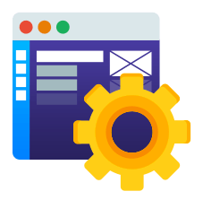
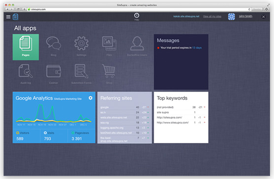
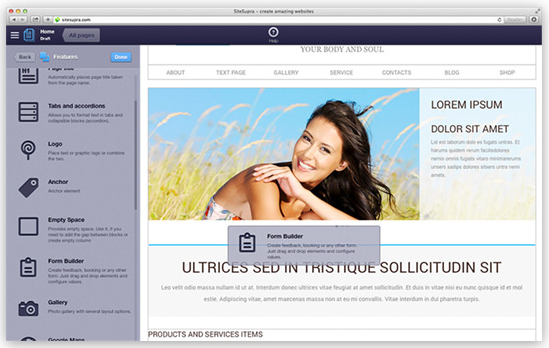
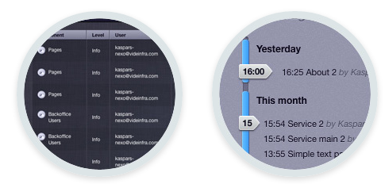
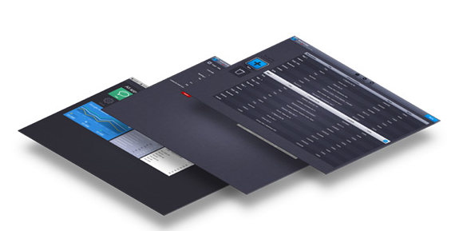

Why Another CMS System
======================

SiteSupra combines a powerful web framework and an elegant CMS to allow developing and managing websites easily. Developers will enjoy SiteSupra while building simple websites or large, feature-rich web apps. Website editors will love SiteSupra because of advanced CMS features packed into unique elegant and simple interface. While there are many great web frameworks and good CMS products separately there are few products that offer those qualities together. SiteSupra is on the mission to bring the best of both worlds in a single product.  

Is SiteSupra the right tool for my website? 
-------------------------------------------

SiteSupra is based on many years of research and development into web frameworks, CMS usability, and now is able to offer solutions for almost any task:

**Corporate and enterprise websites**

Build full-scale multilingual, multi-country websites with ability to maintain a single set of features and localized content, control page localization status, setup content editors access rights and approval workflow. 

**Promo websites**

Develop and manage landing pages or one-pagers easily by setting up HTML into a page template and dragging and dropping required page widgets quickly.

**Web applications**

SiteSupra offers a powerful development framework and an array of internal managers that will allow you developing even very sophisticated web applications easily.

What will be my benefits if I will use SiteSupra?
-------------------------------------------------

**Beautiful CMS**

SiteSupra will add a great value to your website by making website editors fall in love with the CMS. Intuitive, elegant, beautifully-designed, it will allow your clients doing sophisticated website maintenance tasks easily thanks to Word-like visual interface that covers not only text editing, but website structure, page widget functionality and back-office applications management.     

**Industry-standard development approach**

There’s no learning curve developing with SiteSupra if you are familiar with Symfony and Doctrine components. SiteSupra goal is to allow you developing advanced application using well-known PHP components instantly.

**Reusable drag-and-drop page widgets**

Code a page block once and drag-and-drop it anywhere on the site and reuse later in other websites. SiteSupra ships with expanding selection of widgets to allow you creating and managing website handily. 

**Rich CMS and back-office features**

Enjoy advanced CMS features as page versions, scheduled publish and undo history all packed in a beautiful UI accessible without any learning by regular business users. In case of an enterprise environment set up access rights to internal applications or website pages and maintain role-based approval workflow.  

**Extensive modification capacity**

Implement your own logic where needed through custom routes and controllers. SiteSupra has no limitations whether you decide to build a responsive themes or not - it's only a matter of how you code HTML. 

What else will I get?
---------------------

**Customisation**

We will be glad to help you developing custom SiteSupra extensions, blocks and modules to enhance your website and bring it to your requirements in the most effective way. 

**Integration** 

Shall you require help developing SiteSupra-based website or web application to your unique requirements we will be happy to assist through all development cycle starting with front-end development to SiteSupra blocks and modules. 

**Support**

We offer help and assistance for your SiteSupra development tasks as well for system installation and maintenance.   

